# CarCar

Team:

* Michael Gianoulakis - Service - branch-1
* Sina Klughardt - Sales - branch-2

## Service microservice

The service microservice has three models including: Technician, Appointment, and AutomobileVO.

The AutomobileVO model is used to access the automobile model from the inventory microservice through a polling process. When the automobile data is obtained, it can then be referenced for use in the service microservice.
It has a vin and import_href field obtained from the inventory to use when showing information for appointments.

The Technician model has a first_name, last_name, and an employee_id field.
The first_name and last_name are used for a technician's full name and the employee_id is used to reference a specific technician for the purpose of scheduling service appointments.
Technicians can then be created in the database using a POST request: (http://localhost:8080/api/technicians/).
They can also can also be listed out to display using a GET request: (http://localhost:8080/api/technicians/). This is used for obtaining a list of all technicians currently in the database.
Technicians can also be deleted from the database using a DELETE request: (http://localhost:8080/api/technicians/). This will also remove them from lists mentioned in the previous GET request.

The Appointment model has fields that include date_time, reason, status, vin, customer, and technician.
The date_time field is used to schedule service appointments at specific times. When displaying appointments on the frontend, this splits the data into date and time separately.
The reason field is used to explain why a service appointment is needed for an automobile. Examples might include an oil change, battery replacement, or general maintenance.
The status describes if the appointment is pending (default after appointment creation), cancelled, or finished.
The automobiles vin is an implemented to determine which cars are schedule for service appointments. Vins can be cross-referenced with the vins from automobiles sold from the dealership. On the frontend, this is used to mark customers as VIP.
A customer field is used to match a customer name to an appointment.
A technician field is used to assign a technician from the database (using the Technician foreign key) to an appointment.
An appointment list can be obtained through GET request: (http://localhost:8080/api/appointments/). This is used to list all all appointments and also show the service history.
An appointment can be created by using a POST request: (http://localhost:8080/api/appointments/). This will add a new appointment for an automobile to be serviced.
Appointments can be removed from the database with the DELETE request: (http://localhost:8080/api/appointments/). This will remove the specified service appointment from the the list of appointments mentioned in the previous GET request.
Appointments can be updated to change the status field in the model based on the PUT request used: (http://localhost:8080/api/appointments/1/cancel) and (http://localhost:8080/api/appointments/1/finish). These requests will update the status to cancel or finish respectively.

## Sales microservice

Explain your models and integration with the inventory
microservice, here.

## How to Run this Project

Here are step by step instructions to run this project:
1. clone this Repository to the local machine
Run the following commands in the project directory:
2. docker volume create beta-data
2. docker compose-build
3. docker compose-up
(If on mac, safely ignore the warning about an environment variable)
4. Check if all containers are running
5. In your browser go to http://localhost:3000/

## Project Diagram

Diagram of the different services and how they interact with each other. (Front and backend):

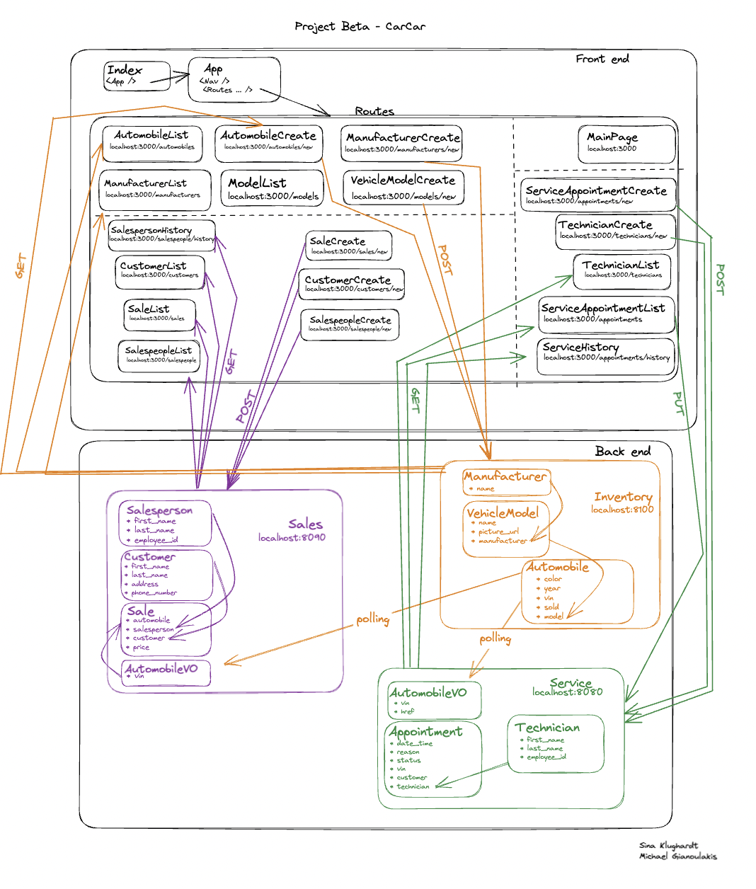

## API Documentation

### Manufacturers

Endpoint: List manufacturers \
Url: http://localhost:8100/api/manufacturers/ \
Description: show a list of all manufacturers \
What is necessary: Just the URL and a GET request \

Click for example image

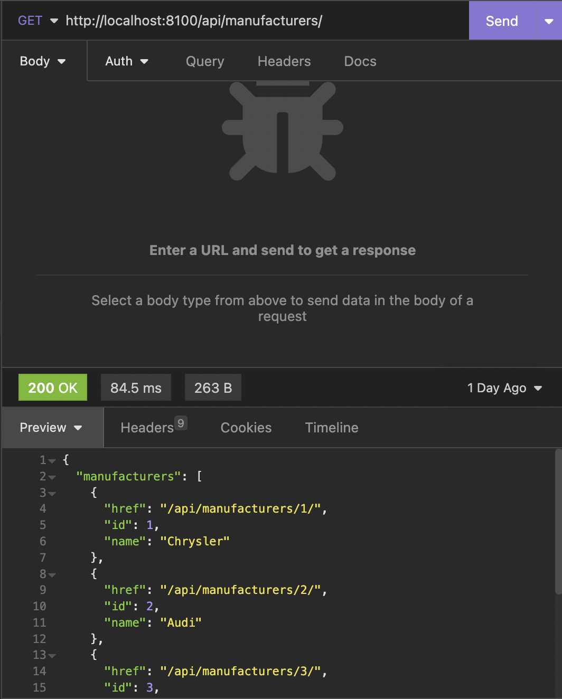

 

Endpoint: Create manufacturers \
Url: http://localhost:8100/api/manufacturers/ \
Description: Create a new manufacturer \
What is necessary: JSON body with field "name", URL with the POST request \

Click for example image

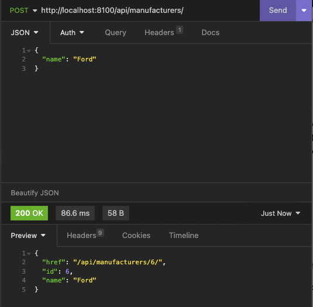

 

Endpoint: Get a manufacturer \
Url: http://localhost:8100/api/manufacturers/:id \
Description: Show a specific manufacturer \
What is necessary: Path parameter as an id, URL with a GET request \

Click for example image

 

Endpoint: Update manufacturer \
Url: http://localhost:8100/api/manufacturers/:id \
Description: Update a specific manufacturer \
What is necessary: Path parameter as an id, JSON body with field "name", URL with a PUT request \

Click for example image

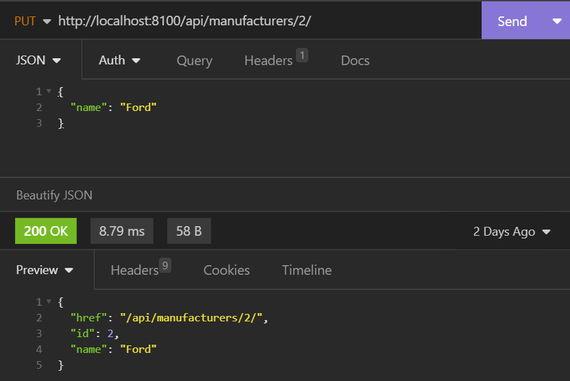

 

Endpoint: Delete manufacturer \
Url: http://localhost:8100/api/manufacturers/:id \
Description: delete a specific manufacturer \
What is necessary: Path parameter as an id, URL with a DELETE request \

Click for example image

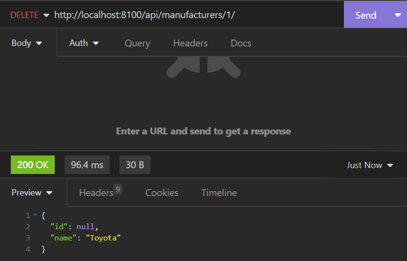

 

### Vehicle Models

Endpoint: List models \
Url: http://localhost:8100/api/models/ \
Description: show a list of all models \
What is necessary: Just the URL and a GET request \

Click for example image

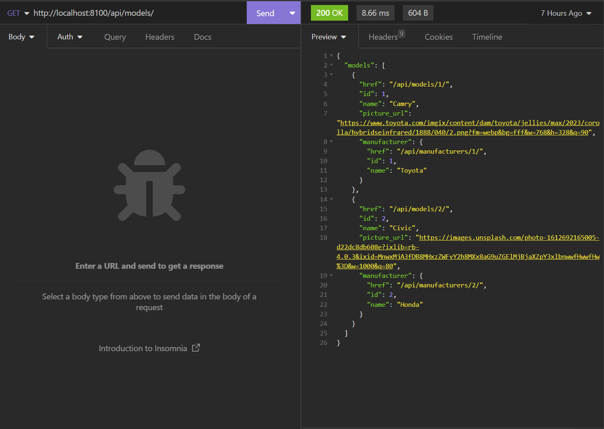

 

Endpoint: Create model \
Url: http://localhost:8100/api/models/ \
Description: Create a new model \
What is necessary: JSON body with field "name", "picture_url", "manufacturer_id". URL with the POST request \

Click for example image

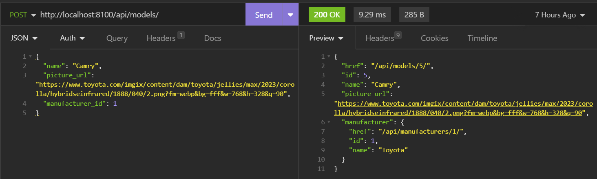

 

Endpoint: Get a model \
Url: http://localhost:8100/api/models/:id \
Description: Show a specific model \
What is necessary: Path parameter as an id, URL with a GET request \

Click for example image

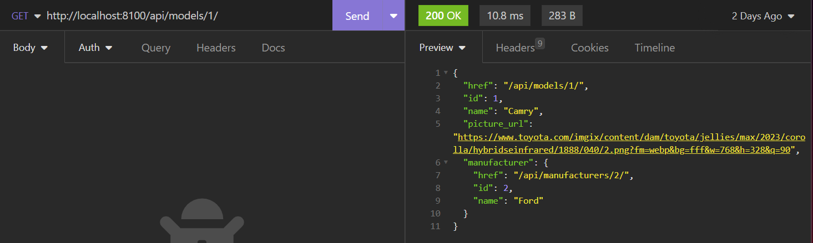

 

Endpoint: Update model \
Url: http://localhost:8100/api/models/:id \
Description: Update a specific model \
What is necessary: Path parameter as an id, JSON body with at least one of the fields from the following: "name", "picture_url", "manufacturer_id". URL with a PUT request \

Click for example image

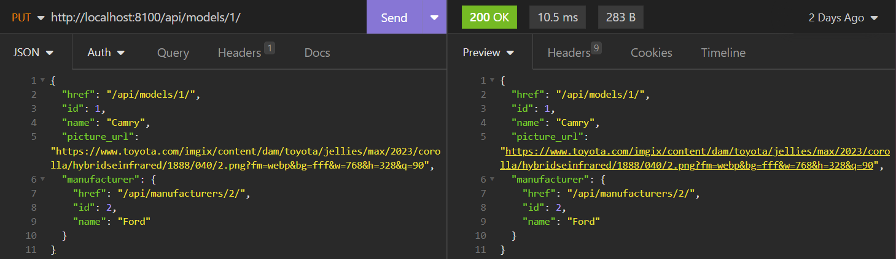

 

Endpoint: Delete model \
Url: http://localhost:8100/api/models/:id \
Description: delete a specific model \
What is necessary: Path parameter as an id, URL with a DELETE request \

Click for example image

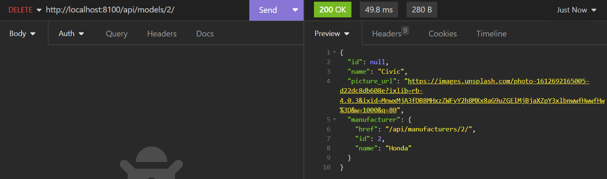

 

### Automobiles

Endpoint: List automobiles \
Url: http://localhost:8100/api/automobiles/ \
Description: show a list of all automobiles \
What is necessary: Just the URL and a GET request \

Click for example image

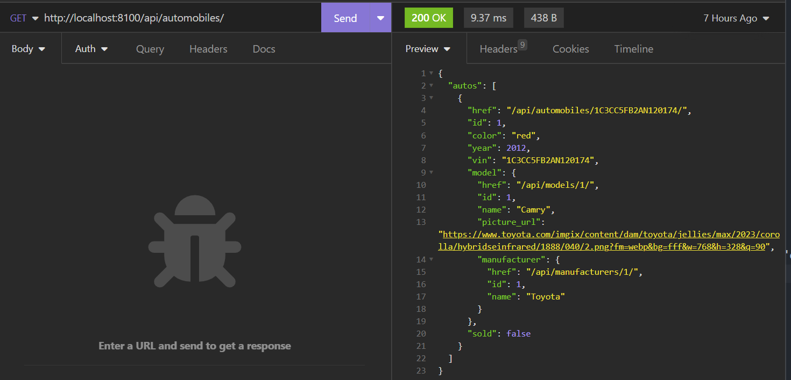

 

Endpoint: Create automobile \
Url: http://localhost:8100/api/automobiles/ \
Description: Create a new automobile \
What is necessary: JSON body with field "color", "year", "vin", "sold", and "model". URL with the POST request \

Click for example image

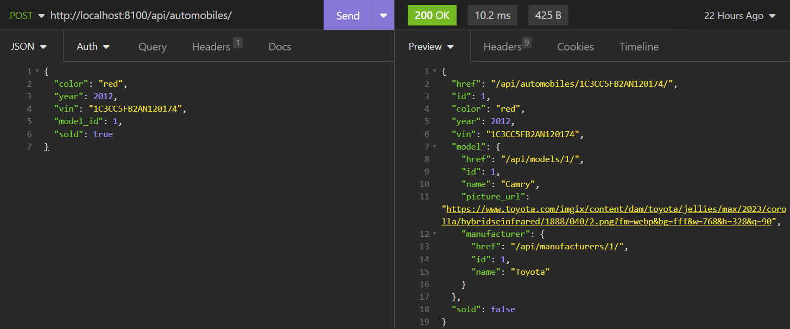

 

Endpoint: Get a automobile \
Url: http://localhost:8100/api/automobiles/:id \
Description: Show a specific automobile \
What is necessary: Path parameter as an id, URL with a GET request \

Click for example image

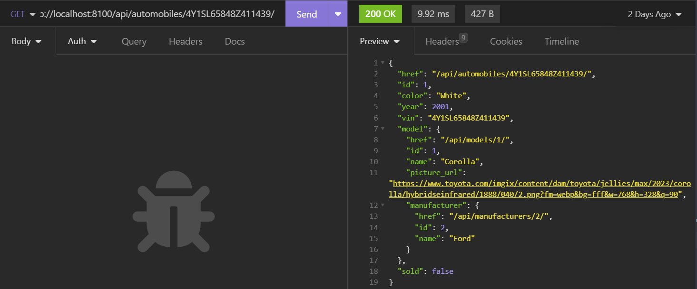

 

Endpoint: Update automobile \
Url: http://localhost:8100/api/automobiles/:id \
Description: Update a specific automobile \
What is necessary: Path parameter as an id, JSON body with at least one of the fields from the following: "color", "year", "vin", "sold", and "model". URL with a PUT request \

Click for example image

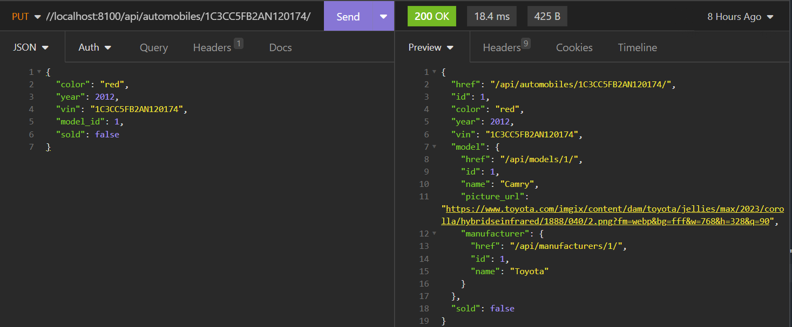

 

Endpoint: Delete automobile \
Url: http://localhost:8100/api/automobiles/:id \
Description: delete a specific automobile \
What is necessary: Path parameter as an id, URL with a DELETE request \

Click for example image

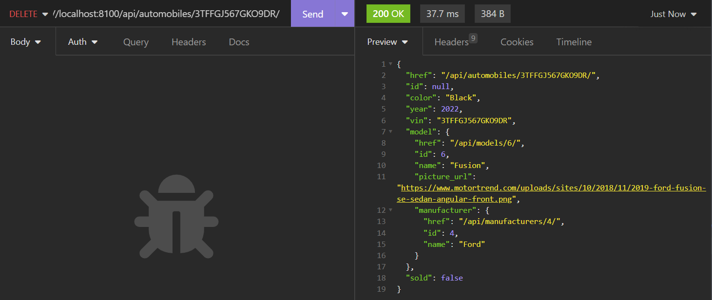

 

### Technicians

Endpoint: List technicians \
Url: http://localhost:8080/api/technicians/ \
Description: show a list of all technicians \
What is necessary: Just the URL and a GET request \
Example: \
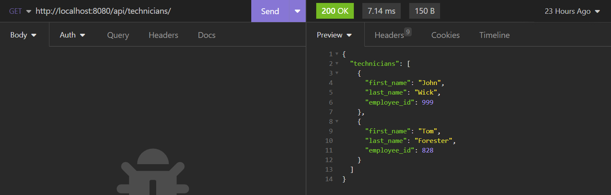

Endpoint: Create technician \
Url: http://localhost:8080/api/technicians/ \
Description: Create a new technician \
What is necessary: JSON body with field "first_name", "last_name", and "employee_id". URL with the POST request \
Example: \
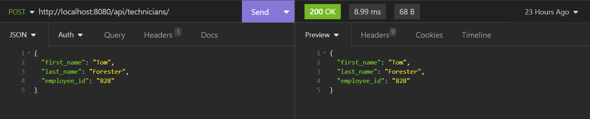

Endpoint: Delete technician \
Url: http://localhost:8080/api/technicians/:id \
Description: delete a specific technician \
What is necessary: Path parameter as an id, URL with a DELETE request \
Example: \
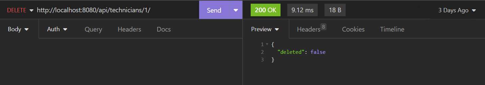

### Appointments

Endpoint: List appointments \
Url: http://localhost:8080/api/appointments/ \
Description: show a list of all appointments \
What is necessary: Just the URL and a GET request \
Example: \
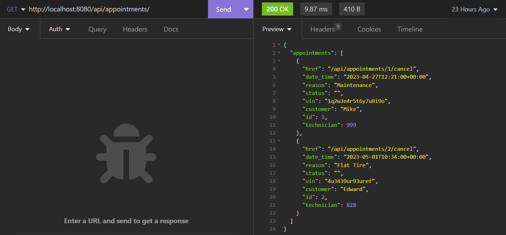

Endpoint: Create appointment \
Url: http://localhost:8080/api/appointments/ \
Description: Create a new appointment \
What is necessary: JSON body with field "date_time", "reason", "status", "vin", "customer", and "technician". URL with the POST request \
Example: \
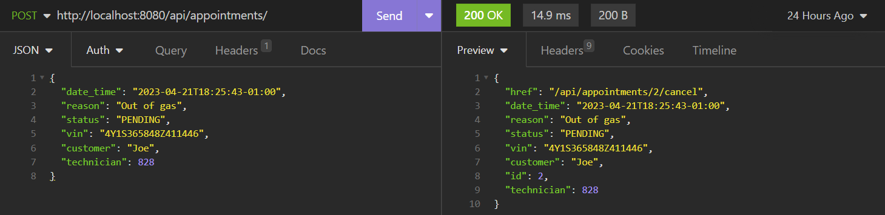

Endpoint: Delete appointment \
Url: http://localhost:8100/api/appointments/:id/ \
Description: delete a specific appointment \
What is necessary: Path parameter as an id, URL with a DELETE request \
Example: \
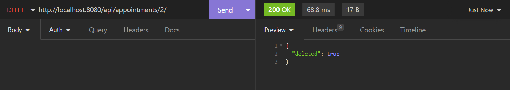

Endpoint: Update appointment \
Url: http://localhost:8100/api/appointments/:id/cancel \
Description: Update a specific appointment to the cancel status \
What is necessary: Path parameter as an id, URL with a PUT request \
Example: \
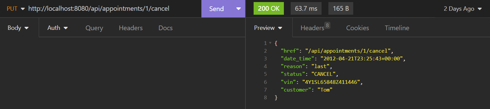

Endpoint: Update automobile \
Url: http://localhost:8080/api/appointments/:id/finish \
Description: Update a specific appointment to the finish status \
What is necessary: Path parameter as an id, URL with a PUT request \
Example: \
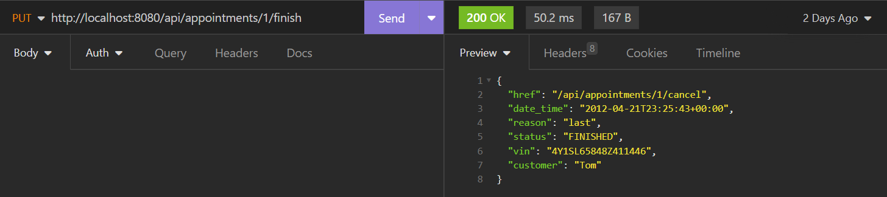
