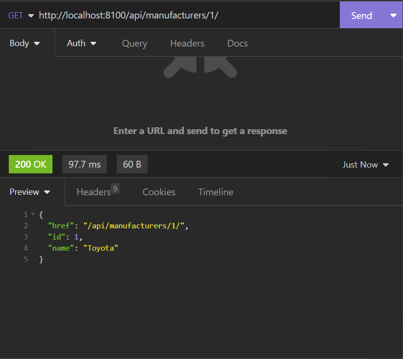

# CarCar

Team:

* Person 1 - Which microservice? Michael Gianoulakis - Service - branch-1
* Person 2 - Which microservice? Sina Klughardt - Sales - branch-2

## Service microservice

Explain your models and integration with the inventory
microservice, here.

## Sales microservice

Explain your models and integration with the inventory
microservice, here.

## How to Run this Project

Here are step by step instructions to run this project:
1. clone this Repository to the local machine
Run the following commands in the project directory:
2. docker volume create beta-data
2. docker compose-build
3. docker compose-up
(If on mac, safely ignore the warning about an environment variable)
4. Check if all containers are running
5. In your browser go to http://localhost:3000/

## Project Diagram

Diagram of the different services and how they interact with each other. (Front and backend):

## API Documentation

- For each of the services, add the documentation describing how to interact with each endpoint across the various HTTP methods implemented. Include the information that is needed for a request and where it needs to be included in the request(ie. header, path parameter, request body). Include the information that is returned from the server in the response. Insomnia can be very helpful in helping you put together this information

### Manufacturers

Endpoint: List manufacturers \
Url: http://localhost:8100/api/manufacturers/ \
Description: show a list of all manufacturers \
What is necessary: Just the URL and a GET request \

Click for example image

/
/

Endpoint: Create manufacturers \
Url: http://localhost:8100/api/manufacturers/ \
Description: Create a new manufacturer \
What is necessary: JSON body with field "name", URL with the POST request \

Click for example image

\
\

Endpoint: Get a manufacturer \
Url: http://localhost:8100/api/manufacturers/:id \
Description: Show a specific manufacturer \
What is necessary: Path parameter as an id, URL with a GET request \

Click for example image

\
\

Endpoint: Update manufacturer \
Url: http://localhost:8100/api/manufacturers/:id \
Description: Update a specific manufacturer \
What is necessary: Path parameter as an id, JSON body with field "name", URL with a PUT request \

Click for example image

\
\

Endpoint: Delete manufacturer \
Url: http://localhost:8100/api/manufacturers/:id \
Description: delete a specific manufacturer \
What is necessary: Path parameter as an id, URL with a DELETE request \

Click for example image

\
\

### Vehicle Models

Endpoint: List models \
Url: http://localhost:8100/api/models/ \
Description: show a list of all models \
What is necessary: Just the URL and a GET request \

Click for example image

\
\

Endpoint: Create model \
Url: http://localhost:8100/api/models/ \
Description: Create a new model \
What is necessary: JSON body with field "name", "picture_url", "manufacturer_id". URL with the POST request \

Click for example image

\
\

Endpoint: Get a model \
Url: http://localhost:8100/api/models/:id \
Description: Show a specific model \
What is necessary: Path parameter as an id, URL with a GET request \

Click for example image

\
\

Endpoint: Update model \
Url: http://localhost:8100/api/models/:id \
Description: Update a specific model \
What is necessary: Path parameter as an id, JSON body with at least one of the fields from the following: "name", "picture_url", "manufacturer_id". URL with a PUT request \

Click for example image

\
\

Endpoint: Delete model \
Url: http://localhost:8100/api/models/:id \
Description: delete a specific model \
What is necessary: Path parameter as an id, URL with a DELETE request \

Click for example image

\
\

### Automobiles

Endpoint: List automobiles \
Url: http://localhost:8100/api/automobiles/ \
Description: show a list of all automobiles \
What is necessary: Just the URL and a GET request \

Click for example image

\
\

Endpoint: Create automobile \
Url: http://localhost:8100/api/automobiles/ \
Description: Create a new automobile \
What is necessary: JSON body with field "color", "year", "vin", "sold", and "model". URL with the POST request \

Click for example image

\
\

Endpoint: Get a automobile \
Url: http://localhost:8100/api/automobiles/:id \
Description: Show a specific automobile \
What is necessary: Path parameter as an id, URL with a GET request \

Click for example image

\
\

Endpoint: Update automobile \
Url: http://localhost:8100/api/automobiles/:id \
Description: Update a specific automobile \
What is necessary: Path parameter as an id, JSON body with at least one of the fields from the following: "color", "year", "vin", "sold", and "model". URL with a PUT request \

Click for example image

\
\

Endpoint: Delete automobile \
Url: http://localhost:8100/api/automobiles/:id \
Description: delete a specific automobile \
What is necessary: Path parameter as an id, URL with a DELETE request \

Click for example image

\
\

### Technicians

Endpoint: List technicians \
Url: http://localhost:8080/api/technicians/ \
Description: show a list of all technicians \
What is necessary: Just the URL and a GET request \
Example: \

Endpoint: Create technician \
Url: http://localhost:8080/api/technicians/ \
Description: Create a new technician \
What is necessary: JSON body with field "color", "year", "vin", "sold", and "model". URL with the POST request \
Example: \

Endpoint: Delete technician \
Url: http://localhost:8080/api/technicians/:id \
Description: delete a specific technician \
What is necessary: Path parameter as an id, URL with a DELETE request \
Example: \

### Appointments

Endpoint: List appointments \
Url: http://localhost:8080/api/appointments/ \
Description: show a list of all appointments \
What is necessary: Just the URL and a GET request \
Example: \

Endpoint: Create appointment \
Url: http://localhost:8080/api/appointments/ \
Description: Create a new appointment \
What is necessary: JSON body with field "color", "year", "vin", "sold", and "model". URL with the POST request \
Example: \

Endpoint: Update appointment \
Url: http://localhost:8100/api/appointments/:id/cancel \
Description: Update a specific appointment to the cancel status \
What is necessary: Path parameter as an id, JSON body with at least one of the fields from the following: "color", "year", "vin", "sold", and "model". URL with a PUT request \
Example: \

Endpoint: Update automobile \
Url: http://localhost:8080/api/appointments/:id/finish \
Description: Update a specific appointment to the finish status \
What is necessary: Path parameter as an id, URL with a DELETE request \
Example: \
